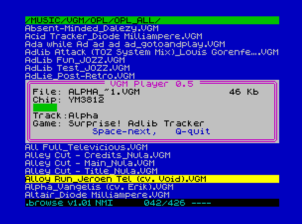

# VGM-Plugin-for-DivMMC
VGM Player is a simple plugin for the NMI browser (ESXDOS) that allows playback of VGM audio files on ZX Spectrum-compatible hardware. Supported sound chips: AY-3-8910, YMF262 (OPL3), YM3812 (OPL2)

Current version: 0.61

https://t.me/pentadiv

